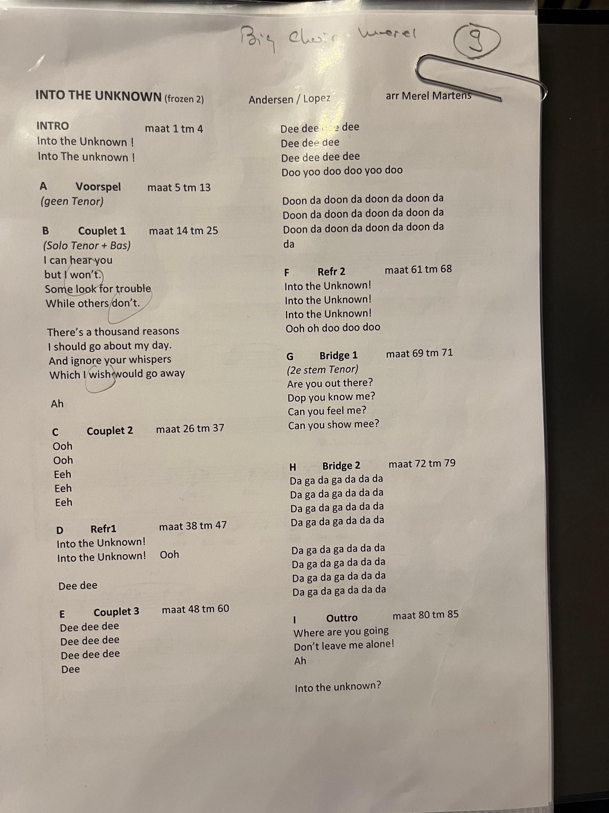

# VPJD2024

Feel free to contact me at jeroen.janssen@gmail.com if you have any questions or additions.

These are my notes from the Vocal Pop &amp; Jazz Days 2024.
Collected from discussions with several people on the topics of:

- (AI) Rehearsal Tracks
- The practice of learning new songs (and how to help the brain)

My intention for this is it be a shared resource for everyone that is interested in these topics. There are a lot different approaches to things.

Be open to the the knowledge and experience from others and use whatever fits your needs or situation the best. 

There is no one way.

## Example AI Voice Choir Covers/Rehearsal Tracks

Here are some existing examples of an AI choir singing pop/jazz arrangements (for rehearsal purposes).

- Synthesizer V
  - [Shower The People](https://www.youtube.com/watch?v=7WN3as9pKnQ)
  - [Brothers In Arms](https://www.youtube.com/watch?v=tk_hOnMwIII)
- Ace Studio
  - [Straighten Up And Fly Right](https://www.youtube.com/watch?v=p016PUgodMM)
  - [Winter](https://www.youtube.com/watch?v=vBXxXG_ZApc)
- Vocaloid
  - [Sway](https://www.youtube.com/watch?v=mQu7MWmombI)
  - [All The Things She Said](https://www.youtube.com/watch?v=tBffGOLR734)

## Rehearsal Track Notes

- Piano sounds are typically to short (e.g. when playing long notes)
- Vibraphone/Saxophone/Clarinet are perceived to be not useable by (some?) people
  - pitch needs to be clear/consistent and not drift/no vibrato
- Different styles/versions
  - conductor plays piano and records it as a rehearsal track
  - conductor sings part and records it as a rehearsal track
  - without/with other voice parts
    - note: it is important to hear your voice in connection to the other voice parts
- not everyone can sing and record the soprano/bass parts
- also very useful for new singers in the choir
- breathing sounds are also very important!
- different mixes
  - part only (with/without others softly)
  - stereo mix (part on left, rest on the right - softer)
    - part on the left: so you can hear your own part while driving (sorry UK drivers)
  - click track (untuned)
  - no part (everything except a specific part)
  - exporting mixes one by one (e.g. rebalance parts before each export), manually
    - option to make/have a template with mixbus prepared for exporting rehearsal tracks in one go 
- Can also use a loopstation to record rehearsal tracks
- Choir members could also use MuseScore and "choose their own mix" (but this requires sharing the score file)
- how to get from paper to rehearsal track (when buying an arrangement without tracks)
  - (old, please don't do this) type in all the notes
  - use music scanning software and correct where needed
    - Dorico has some amazing editing/correction capabilities with e.g. inserting/deleting notes in between and automatically adjusting whatever comes afterwards
- look for the best tracks (voices) to prepare to get common sound (song scouts)
  - record selected choir voices (with coaching) for choir rehearsal track
  - different song scout per type of song, the song should be telling us how to sing
- starting note before
- count in
- dynamics (of parts) need to fit in the mix for the specific rehearsal track
- some prefer midi for exact looping on bar level (audio looping is not precise enough)
- bad rehearsal file can prevent you from practicing
- you can combine different things (it is no OR choice, it can be a little bit of all):
  - AI bass voice
  - self recorded voice parts
  - piano parts

 
## Rehearsing Notes

- rehearse behind piano (and play notes of sections repeatedly)
- writing down lyrics by hand (to better remember)
- Using choregraphy with the song (to better remember)
- Rehearse with metronome on 2 and 4 to get timing better
- [Count Singing](https://acda-publications.s3.us-east-2.amazonaws.com/ChorTeach_vol.3_Wine,T.pdf) is the practice of rehearsing a choral work on counts rather than singing the text.
- Use [Basic Steps (VoPa, Intelligent Choir)](https://youtu.be/f1Wy0FFQlYA?si=gGDjbGtt76gVl5p3&t=992) for choir to learn internalize groove/timing.
- analyze score before rehearsing
  - find out which interval you are singing within the chord (1-3-5-7-9, etc) to understand your sound within the whole
  - figure out structure of the song (from AABA form and lyrics perspective),
    
- rehearse "backwards", starting at the end and connect transitions to eachother
- don't overload the brain, stop singing pitch and focus on rhythm, afterwards add pitch again
- neural pathway forging (reinforce what is correct)
- don't pound in notes in rehearsal, know before (individual vs ensemble work)
- tradition (in rehearsing) is difficult to change
- tracks can make people lazy
  - correcting things can be hard (e.g. missing dynamics)
  - imitating (sounding like the track)
- not all songs should have rehearsal tracks
- record the rehearsal to record progress
- not everyone is technology advanced the same way (e.g. using Bandlab to sing with other voices)
- don't give something to listen to that does not sound great
- don't play piano register in singing voice (but octave higher)
  - or only bass (root), fifth
- [Noa Kageyama](https://bulletproofmusician.com/about/): Myth of Mastery
  - You will know tomorrow if you have it mastered
  - random practice vs focused practive
  - frame of concentration
- Dr. Molly Gebrian: [Learn Faster, Perform Better: A Musician’s Guide to the Neuroscience of Practicing](https://www.mollygebrian.com/music-and-the-brain)
- location of rehearsing at home
  - car typically only has audio, no sheetmusic. connecting visual/audio impossible in car
- listen to your part, sing against the rest
- making cheat sheets (small by hand)
- want to hear chords of the song to get a picture
  - and then find out what note to sing
- "memorize on the toilet"

## Brain Notes

- [Brain Gym](https://www.leneurogroupe.org/brain-gym?lang=en#:~:text=The%20Brain%20Gym%20program%20consists,%2C%20centering%2C%20comprehension%20and%20concentration) is a method using movement and artistic activities to improve learning abilities.
- To sing from memory, you need to actively "put the paper down" early in rehearsals (not "at the end")
- [Audiation](https://kb.gcsu.edu/cgi/viewcontent.cgi?article=1136&context=grposters#:~:text=Audiation%20is%20the%20cognitive%20ability,is%20a%20manifestation%20of%20audiation) is the cognitive ability to internally hear and understand music.

## Software Notes

- Musescore scanning sheet music does not give satisfying results at the moment
  - typing in by hand instead
  - or correcting scanned parts
- Mix different part tracks by hand (changing volume, export, multiple times)
- What is possible? How to start? Introduction/Workshop?
- AI Voice Programs
  - [Vocaloid](https://www.vocaloid.com/en/vocaloid6/)
    - Trial version 31 days
    - $225, includes 14 voices
  - [Synthesizer V Studio](https://dreamtonics.com/synthesizerv/)
    - Basic (free, no advanced features)
    - Pro (paid) $89 without voices, voice packs typically $90
    - [How to Purchase, Download, and Install Synthesizer V Studio and Voice Databases](https://synthv.info/guide-install)
  - [Ace Studio](https://www.acestudio.ai)
    - 14 day trial
    - Subscription monthly($22/m)/yearly($13/m), includes voices
- Choir Rehearse App
  - [Rehearse App](http://www.rehearse.nl/welcome-to-the-rehearse-app/) for anyone who wants to practice anywhere alone, to be well prepared to rehearse or perform together later on. Rehearse was first designed to be used in the Netherlands, but also supports other languages.
- correcting a scan
  - listen to a part while looking at the sheetmusic and check for incorrect things
  - or use entering lyrics as a way to check if all the rhythm of the notes are correct (if not then the syllables will not match up) 
- PlayScore2 scanning sheetmusic
- capella-scan
- converted midi files (from scanning) sometimes have issues with time signature changes
- don't worry about what the "best" (notation) program is, just get familiar with one and make the best use of it
  - the more you use it, the faster you get

## Thanks

Thank you to all the participants at the Vocal Pop & Jazz Days that I got to talk about these topics during our week. I was not expecting such positive feedback and different perspectives on this. We have a great singing communitity and it is amazing to learn from others and also be able to share my experiences and knowledge to people.

## TODO

- process my latest notes
- add links to example ai choir videos (vocaloid, ace studio, synthesizer v)
- add links to existing choir instruction/demo videos of applications
  - including vocoflex
- make overview picture of different ways to approach creating rehearsal tracks
